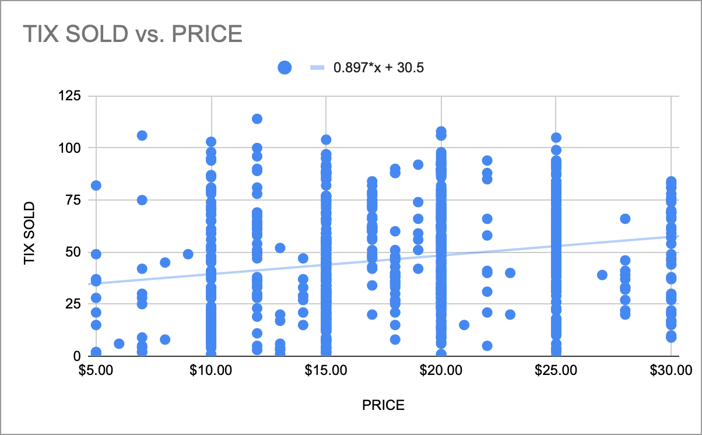

# Case Study #1: Do higher priced tickets drive down demand?

**Hello fellow data enthusiasts!**

I've really enjoyed all the data insights being shared, and so I wanted to contribute a few of my own. Back in my venue operator days, I started an in house Venue Analytics Shop, where I worked to understand our business better, and (hopefully) make us more money. 💰 Most insights were based off ticketing data retrieved from the Eventbrite API.

## The Question

**Do higher priced tickets drive down demand?**

## Approach

Chart the ticket price (x axis) vs the final number of tickets sold (y axis) for all paid shows at our venue and run a linear regression. The first version of this chart was generated c2016. The version below was created in 2020 and includes a few thousand data points.

## Result

**No!** In fact, we found a **(slightly) positive relationship** between ticket price and total tickets sold.

**Regression equation:** `y = 0.897*x + 30.5`

## How did this help our business?

While not conclusive, it lent some credibility to a theory I had, that **price was relevant to the perceived quality of a show.** (i.e. When someone sees a show is $5 they may regard is as lower quality than if it's $25.) 

It was very impactful in convincing our renters that they could **raise their ticket prices (at least up to ~$30)**, and not experience a drop in total tickets sold. This meant we could raise our rental prices, and producers could pass that cost onto ticket buyers.

## Business Impact

### Strategic Changes
- Encouraged producers to price tickets in the $20-30 range (vs $10-15 previously)
- Increased venue rental rates proportionally
- Positioned venue as premium entertainment destination

### Results Over 2 Years
- Average ticket price: **+25%**
- Average attendance: **No decrease**
- Venue rental revenue: **+20%**
- Producer profitability: **Maintained** (higher gross despite higher rent)

## Key Takeaway

> **Price signals quality in entertainment.** Don't assume standard economic models apply to experiential goods.

## Technical Details

### Data
- **Timeframe:** 2016-2020
- **Sample Size:** Thousands of events
- **Venue:** Main stage only (consistent capacity)
- **Method:** Simple linear regression

### Limitations
- Correlation, not causation
- Didn't control for marketing spend or show quality
- Unknown price ceiling (where does the positive relationship break down?)

---

*Part of the [Theater Venue Analytics](../) project series*
