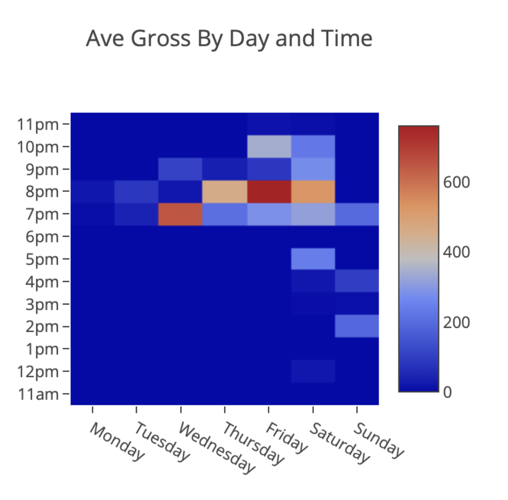
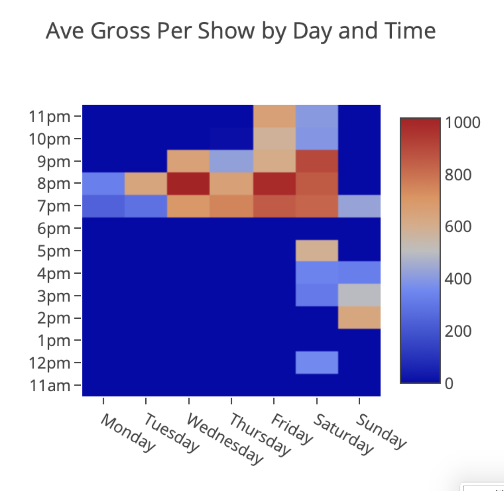
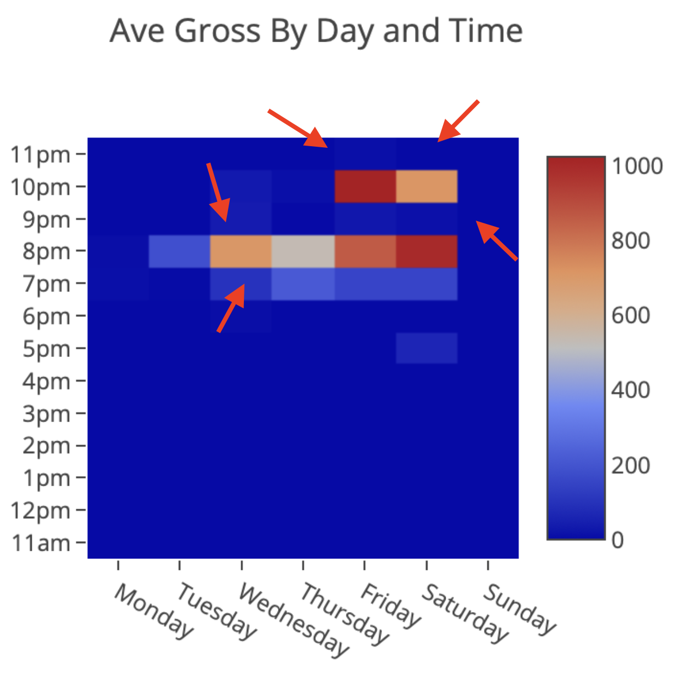

# What are the most valuable show start times in our weekly calendar?

:data_party: **Hello again fellow data enthusiasts!** :data_party:

I'm back with another case study from the PianoFight Venue Analytics Shop.

## The Question

**What are the most valuable show start times in our weekly calendar?**

## Approach

Plot the average revenue generated across all shows starting on a given day of the week and at a given time of day. This chart was generated for all shows on our main stage in 2016, and averaged the total revenue of a start time (e.g. Fridays at 8pm) divided by 52 weeks/year.

## Initial Result

**Friday at 8pm is the most valuable start time in our weekly calendar.**

But, wait! Is it really?? 

## The Plot Twist

Fridays at 8pm are also booked more frequently than mid week or late night start times (e.g. Wednesdays at 8pm, or Saturdays at 10pm).

This brought up a second question: **What if, instead of averaging the revenue across 52 weeks in the year, we averaged only by number of shows that occurred at that start time during the year?**

And thus we got this second chart, which visually shows much less concentrations around those "prime time" start times.

## Refined Result

**When shows are booked mid week, or late night, they are more successful than we thought which means we are overweighting the value of Fridays and Saturdays at 8pm!**

## Business Impact

After two years of actioning on this data, and pushing more shows to late night and mid week start times, our average revenue generated by week in 2018 looked very different, with much better results from our mid week and late night shows, and **more total revenue!** 💰

## Strategic Changes

- **Redistributed programming** from "prime time" to underutilized slots
- **Actively promoted** Wednesday comedy and Saturday 10PM late shows
- **Stopped overvaluing** Friday/Saturday 8PM slots
- **Maximized inventory** across all available time slots

## Key Takeaway

> **Choose your metrics carefully.** How you normalize data (per-week vs per-show) dramatically changes what you see. Always ask "what am I actually measuring?"

## Technical Details

### Analysis Method
- Multi-dimensional aggregation (day × time × revenue)
- Two normalization strategies:
  1. **Per-week:** Total revenue ÷ 52 weeks
  2. **Per-show:** Total revenue ÷ number of shows
- Longitudinal validation (2016 strategy → 2018 results)

### Key Insight
Shows in "off-peak" time slots weren't performing poorly—they were just scheduled less frequently. When we increased their frequency, total venue revenue grew.

---

*Part of the [Theater Venue Analytics](../) project series*
