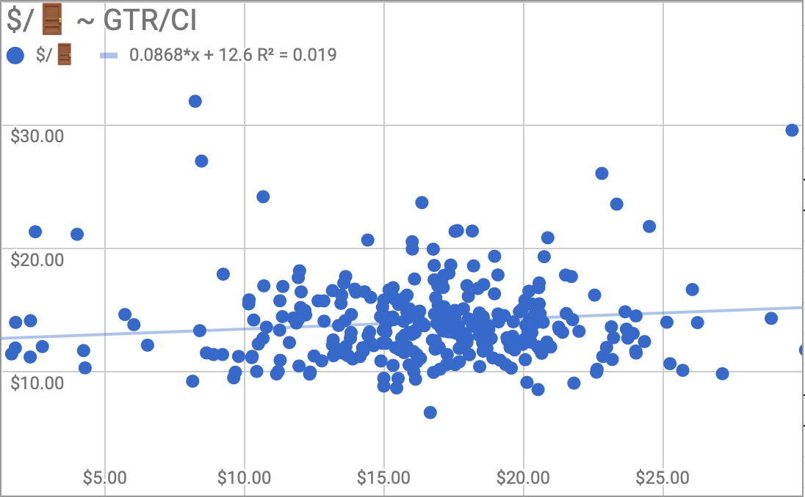

# Do higher ticket prices correlate to higher bar sales?

:data_party: **Hello once again fellow data enthusiasts!** :data_party:

Here's another case study from the PianoFight Venue Analytics Shop.

## The Question

**Do higher ticket prices correlate to higher bar sales?**

## Hypothesis

I thought folks who bought more expensive tickets would also buy more expensive drinks and food items. Seems logical, right?

## Approach

Chart the average ticket price of all tickets sold to a given night vs the average bar sales per attendee on the same night.

## Result

**Actually, not really!** Big ticket spenders spent on average about the same on drinks and food as folks buying cheaper tickets.

This came as a bit of surprise! But the data showed that our customers were evaluating events they might attend with far less of an eye toward the price, than the food and drink items they were considering when on site.

## Why This Matters

**Side note:** maybe I shouldn't have been so surprised, since this result did seem rather consistent with the lessons of our previous case studies 🤔

This finding reinforced that:
- Customers evaluate **entertainment purchases differently** than food/drink purchases
- Price sensitivity varies by purchase category
- Lower-priced shows still drive equivalent bar revenue

## Business Impact

### Strategic Implications
- **Don't underestimate low-priced shows:** They fill seats and drive bar sales just as well
- **Bar revenue is consistent:** Plan staffing based on attendance, not ticket price
- **Mixed programming strategy:** Balance high and low ticket prices to maximize both revenue streams

### Key Insight
> **Customer behavior isn't uniform across purchase types.** Someone willing to splurge on a $30 ticket may still order a $5 beer, while someone who found a $10 ticket deal might order the same $5 beer.

## Technical Details

### Data
- **Variables:**
  - X-axis: Average ticket price per show
  - Y-axis: Average bar sales per attendee
- **Method:** Correlation analysis
- **Sample:** All shows with bar sales data tracked

### Limitations
- Didn't control for show type (comedy vs theater might have different drinking patterns)
- Bar menu pricing was consistent across all shows
- Didn't track individual customer behavior across purchases

---

*Part of the [Theater Venue Analytics](../) project series*
